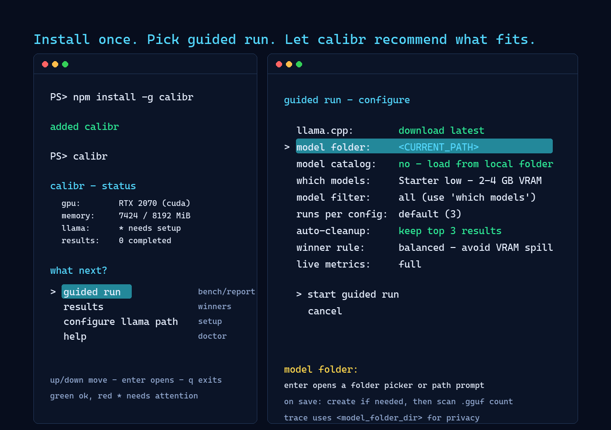
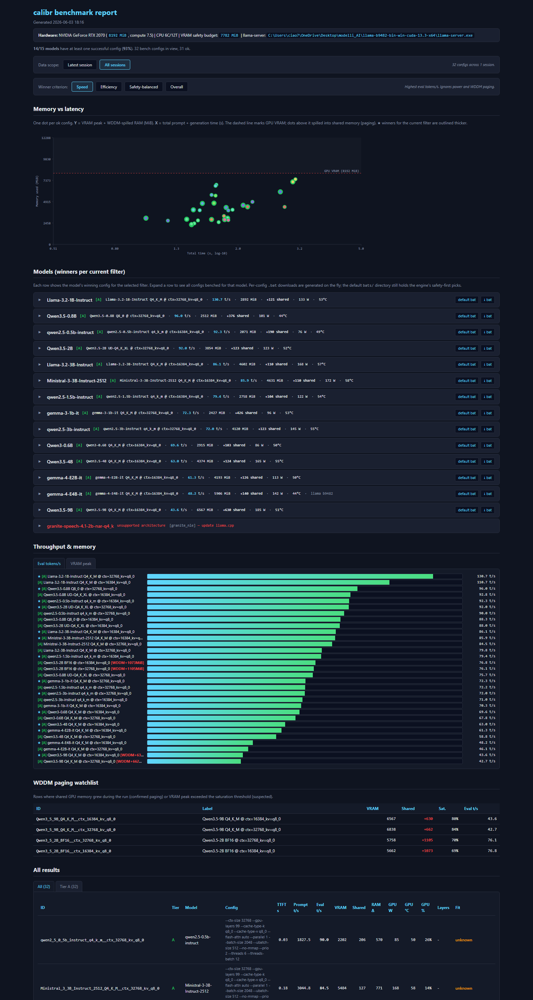

# calibr — find the local LLM setup your GPU can actually run

> A `--ctx-size 262144` flag silently caused Windows to page model weights to
> system RAM, dropping eval from 45 t/s to 10 t/s. No error, no warning.
> `calibr` automates the discovery of that cliff and the configuration that
> avoids it.

`calibr` is a guided local-LLM recommender for GGUF models served by
[llama.cpp](https://github.com/ggml-org/llama.cpp). It discovers or downloads
candidate models, sweeps launch configurations, watches real memory behavior,
and shows which model/config fits your hardware under different recommendation
profiles.
Its sweet spot is NVIDIA CUDA on Windows — where it also detects the silent
WDDM VRAM-to-RAM paging cliff — but it **runs on Linux too**, with experimental
macOS/Metal detection in progress. The output is an HTML dashboard plus
per-model optimized launchers (`.bat` on Windows, `.sh` on Linux/macOS).
Action-level diagnostics are written to `logs/action-trace.log` under the
calibr data directory, with `logs/action-trace.jsonl` kept for machine parsing,
so startup/download hangs can be inspected after the fact.

It is not a model-quality judge yet. The recommendation is based on measured
fit, speed, headroom, and spill behavior on your machine.





> **Windows, Linux, experimental macOS.** The silent VRAM→system-RAM spill calibr targets is read
> from a Windows-specific perf counter (`\GPU Adapter Memory(*)\Shared Usage`)
> on Windows, and from **GTT** (via `radeontop`) on AMD/Linux — the same
> downstream spill-detection either way. NVIDIA-on-Linux OOMs cleanly, so there
> is no silent spill to detect there. The Linux engine runs under
> [PowerShell Core (`pwsh`)](https://github.com/PowerShell/PowerShell). GPU
> metrics: `nvidia-smi` (NVIDIA); on AMD, `amd-smi` when ROCm is available,
> plus `radeontop` (live VRAM-used + util + GTT) and `glxinfo`/mesa-utils
> (VRAM total) as fallbacks. macOS detection uses `sysctl`, `vm_stat`, and
> `system_profiler`; Metal support is experimental and needs real-machine
> validation. See [`AGENTS.md`](AGENTS.md) for the phased direction.

> **For an LLM (or contributor) reading this**: start with
> [`AGENTS.md`](AGENTS.md) — it documents the current methodology,
> the three-phase product direction (CLI → backend → web UI), and what
> is REFERENCE ONLY vs authoritative. The folders `architecture/`,
> `spec/`, `plans/`, `memories/` are kept for history but do not
> reflect current practice. Domain vocabulary (`model` / `series` /
> `variant` / `level` / `sweep` / `WDDM` / `headroom`) still lives in
> [`architecture/domain.md`](architecture/domain.md).

---

## Contents

- [Quickstart](#quickstart)
- [What calibr recommends](#what-calibr-recommends)
- [Privacy and model licenses](#privacy-and-model-licenses)
- [Why not just …?](#why-not-just-)
- [Dependencies](#dependencies)
- [Included model catalog](#included-model-catalog)
- [Technical details](#technical-details)
- [Known limitations](#known-limitations)
- [Troubleshooting](TROUBLESHOOTING.md)
- [Roadmap](#roadmap)
- [Contributing](#contributing)
- [License](#license)

---

## Quickstart

Install the guided CLI:

```powershell
npm install -g calibr
calibr
```

You get a menu with `guided run`, `results`, `configure llama path`, and
`help`. Walk through it with arrow keys + enter.
If something won't start, open `help` -> `doctor`: it checks your CPU/GPU/OS
and every dependency, tells you exactly what's missing and how to fix it, and
can export a redacted bundle to attach to a GitHub issue. Start with
`guided run`: it is the consumer path that sets up llama.cpp, downloads or
scans models, benchmarks them, and builds the report. It defaults to the
starter `low` scope and auto-cleans downloaded files after each model. You
can also keep all downloaded models, or keep only the top 3 / top 1 current
winners according to the selected winner rule. Switch the scope to `middle`,
`high`, `ultra`, or `all` when you want the broader catalog sweep.
The menu marks setup items with a green check when ready, or a red `*` when
they need attention.

On a fresh machine, `guided run` asks how to set up llama.cpp if
`llama_server_exe` is missing: download an official release (latest by default,
or type a `bNNNN` build tag), or scan for existing local `llama-server`
binaries. One local binary is selected automatically; multiple binaries open a
picker. A typed build tag is saved as the preferred auto-fetch build for later
runs. Use `configure llama path` when you already know the exact custom build
you want to keep, or to reuse/delete cached auto-fetched llama.cpp builds.

Winning configurations land in `data/bats/{model}.bat` on Windows (double-click
to launch) or `data/bats/{model}.sh` on Linux (an executable `chmod +x` script)
— either way, llama-server runs with the optimized flags.

Don't have any `.gguf` files yet? Pick `guided run`, keep `source: catalog downloads`,
choose the llama.cpp setup when prompted, and let calibr walk the curated set
one model at a time:
download -> bench -> cleanup -> next model -> report.

Already have local `.gguf` files? In `guided run`, set `local folder` to that
directory, then set `source: local folder`. The default local folder is
`<CURRENT_PATH>`, the folder where you launched `calibr`. When
you save a folder, calibr stores it in config, checks whether it exists, offers
to create it if needed, and reports how many `.gguf` models it found. In this
mode, `model` lists the local models found in that folder. Files in the
local folder are user-owned: cleanup applies only to files downloaded during
the current run.

## What calibr recommends

`calibr` recommends from measurements it actually ran: model file,
quant/variant, context/KV-cache choice, offload flags, memory behavior, and a
ready launcher.

There is not one universal winner. The report exposes profiles:

- **Speed**: highest measured `eval_tps`. It ignores spill and power.
- **Safety-balanced**: fastest config that did not page into shared/system
  memory. This matches the default launcher pick.
- **Efficiency**: best tokens per watt when GPU power data is available.
- **Overall**: weighted view across speed, safety, and efficiency.

"Safe" currently means no confirmed shared-memory spill. On Windows, that is a
delta above `wddm_detection.shared_delta_confirm_mib` (default `500 MiB`) in
the WDDM shared-memory counter. A high VRAM saturation warning also appears
above `wddm_detection.vram_saturation_threshold` (default `0.92`, or 92% of
VRAM), but the hard disqualifier for the default safety picker is confirmed
shared spill. On AMD/Linux, GTT via `radeontop` feeds the same
`shared_peak_mib` signal when available. NVIDIA/Linux usually fails cleanly
instead of silently spilling.

The report also records RAM, VRAM/shared memory, GPU power, temperature,
utilization, headroom, and load/throughput fields. Those are shown for
inspection and secondary scoring, but calibr does not yet optimize for "largest
parameter count that fits" or "lowest memory use". Those are useful future
profiles once the quality/performance tradeoffs are better understood.

On Windows/NVIDIA, dedicated VRAM is reported as a system-level baseline and
peak. NVML / `nvidia-smi` do not expose reliable per-PID dedicated-memory
values under WDDM, so calibr does not pretend the number belongs only to
`llama-server`. The report shows the baseline captured before each config so
background apps, browsers, overlays, or 3D workloads are visible as possible
benchmark pollution.

The warning percentage is calculated as:
`VRAM used before the run / total VRAM * 100`. Baseline is measured before the
benchmark and again before each configuration. For example, `1500 / 8192`
means 18.3% of VRAM was already occupied; thresholds of 5%, 10%, or 15% would
therefore show a warning. Memory charts display estimated benchmark VRAM as
`system peak - baseline`, while retaining the raw system peak in the tooltip.

It does not rank instruction-following quality, coding ability, multilingual
performance, or preference alignment. Treat the winner as "this is the best
performing fit for this hardware", then choose between close candidates by
task quality in the report.

## Privacy and model licenses

Benchmark data stays local under `data/` in a checkout, or under the platform
user-data directory for the npm package. `calibr` does not upload results.
The optional catalog download step fetches GGUF files from upstream model
repositories; those files keep their original licenses and terms.

## Why not just …?

Several tools sit nearby in this space, mostly doing different things
from `calibr`. Some **estimate from hardware constants** without ever
running the model. Some **measure runtime parameters** (prompt size,
batch size, concurrency) rather than launch-time flags. Some
**aggregate community submissions** without measuring on your machine
at all. `calibr`'s slice is narrower and concrete: it measures
launch-flag configurations on **your own hardware** and reports which
one wins.

| Tool | Approach | Gap (relative to calibr) |
|---|---|---|
| llmfit | Pure estimation, hardcoded hardware constants | Does not measure on hardware; mixture-of-experts models treated as dense. TBD — pending hands-on test. |
| llm-checker | Ollama-focused, deterministic scoring, `ai-run` subcommand measures tokens per second | No mixture-of-experts support; Ollama only; no launch-flag sweep. TBD — pending hands-on test. |
| llama-benchy | Sweep over runtime parameters (prompt processing, token generation, depth, concurrency) | Sweeps runtime, not launch flags. TBD — pending hands-on test. |
| llama-bench (built-in to llama.cpp) | Single-configuration benchmark | No sweep across launch flags. |
| llama-sweep-bench | Sweep over performance parameters | Fork-specific to ik_llama; not applicable to mainline llama.cpp. |
| LocalMaxxing | Community leaderboard aggregator | Depends on third-party submissions; no measurement on the user's own hardware. |
| Bench360 | Academic benchmark framework | Not consumer-facing. |

## Dependencies

**Windows (full feature set, incl. WDDM paging detection):**

- **Windows 10/11** with PowerShell 5.1+
- **NVIDIA GPU + recent driver** (tested on RTX 2070 8 GB, compute 7.5)
- `nvidia-smi` on PATH (bundled with the NVIDIA driver)
- **Node.js 18 or newer** and npm for the global `calibr` command.
- A **llama.cpp build** with `llama-server.exe`, preferably CUDA on NVIDIA.
  calibr can auto-fetch the official build during `guided run` / `init`;
  manual install is only needed for custom builds or offline setups.

**Linux:**

- **Node.js 18 or newer** and npm for the global `calibr` command.
- **PowerShell Core (`pwsh`)** — [install guide](https://github.com/PowerShell/PowerShell).
  The npm CLI starts the engine through `pwsh` on Linux.
- A **llama.cpp build** with `llama-server`. calibr can auto-fetch official
  Linux release archives; manual install is only needed for custom builds,
  offline setups, or unsupported platforms.
- A GPU is optional. On **NVIDIA** with `nvidia-smi` on PATH you get VRAM /
  power / temp / util metrics. On **AMD**, `amd-smi` is preferred for ROCm-class
  dedicated GPUs when present; `radeontop` + `mesa-utils`
  (`apt install radeontop mesa-utils`) remain the fallback for VRAM total
  (`glxinfo`), live VRAM-used + GPU utilization (`radeontop`), and GTT spill.
  Without those tools, metrics fall back to sysfs temperature and
  VRAM-budget planning is opt-in (set `hardware.vram_total_mib` yourself).
  CPU-only works too.

**macOS / Metal (experimental):**

- **Node.js 18 or newer**, npm, and **PowerShell Core (`pwsh`)**.
- A local **llama.cpp** build with `llama-server` and the Metal backend.
- `init` / `doctor` can detect Apple GPUs through `system_profiler`, CPU/RAM
  through `sysctl`/`vm_stat`, and mark memory as unified. This path is
  experimental until it is validated on real Apple hardware.

**Not sure what you have or what's missing?** Run `calibr doctor` (or the menu's
`help` -> `doctor`). It detects your CPU/GPU/OS, probes every dependency above,
and prints each with a status and the exact fix — including AMD-APU specifics
(amdgpu vs legacy `radeon` driver, hardware Vulkan vs `llvmpipe`, and the
AVX2/BMI2 source-build flags old CPUs need). `calibr doctor -Export` writes a
redacted JSON bundle for issue reports.

Linux dependency map:

| Dependency | Required? | Used for | Typical package |
|---|---:|---|---|
| `pwsh` | yes | run the engine from the npm CLI | `powershell` (install from Microsoft/PowerShell release docs) |
| `llama-server` | yes, auto/manual | actual llama.cpp inference backend | auto-fetched llama.cpp release or custom build |
| `tar` | yes for auto-fetch on Linux | extract official `.tar.gz` llama.cpp archives | usually preinstalled |
| `bash`, `chmod` | yes for launchers | write executable `.sh` launchers | usually preinstalled |
| `xdg-open` | optional | open `data/report.html` from the CLI | `xdg-utils` |
| `lspci` | optional | Linux GPU-name fallback when `nvidia-smi` is absent | `pciutils` |
| `nvidia-smi` | optional, NVIDIA | NVIDIA VRAM / power / temp / utilization metrics | NVIDIA driver |
| `amd-smi` | optional, AMD dedicated | ROCm-class AMD VRAM / power / temp / utilization metrics | ROCm / amd-smi |
| `radeontop` | optional, AMD | AMD live VRAM-used, GPU utilization, and GTT spill signal | `radeontop` |
| `glxinfo` | optional, AMD | AMD VRAM-total detection | `mesa-utils` |

For an AMD/Vulkan readiness check, `vulkaninfo` (`vulkan-tools`) is useful to
verify that Vulkan sees a hardware GPU rather than only `llvmpipe`.

**llama.cpp build choice:**

The easiest path is to leave `llama.cpp: auto-fetch official build if missing`
enabled. calibr resolves the latest
[llama.cpp release](https://github.com/ggml-org/llama.cpp/releases), picks the
highest compatible CUDA artifact on Windows/NVIDIA, prefers Vulkan for
AMD/Intel-class GPUs, and falls back to CPU when no GPU artifact matches. For
CUDA, it also downloads the matching `cudart-llama` package into the same
folder.

Manual setup still works: get a release from the llama.cpp releases page
(CUDA recommended on NVIDIA), or build from source, then use `configure llama
path`. A Vulkan-only build also works on NVIDIA, but is usually slower than
CUDA. On Windows/NVIDIA, the broadest-compatible llama.cpp release artifact is
usually the CUDA 12.4 build. To pin auto-fetch to a specific llama.cpp tag for
testing, set `CALIBR_LLAMA_CPP_TAG=b9360` before running `calibr`.

Older builds may lack newer model architectures. calibr detects "unknown model
architecture" failures and skips the remaining tests for that model instead of
running every config to fail.

## Included model catalog

The bundled catalog is deliberately conservative: official or near-official
model families from Google/Gemma, Alibaba/Qwen, Meta/Llama, Mistral,
Hugging Face/SmolLM, Microsoft/Phi, IBM/Granite, DeepSeek, and a small number
of widely used GGUF packagers. It avoids random distillations, fine-tunes, and
one-off community remixes because the goal is to recommend a reliable local
baseline.

The exact list lives in [`models_catalog.json`](models_catalog.json). The
guided run's `scope` field comes from
[`default_bench_presets.json`](default_bench_presets.json):

| Scope | Target hardware | Contents |
|---|---|---|
| `low` | 2-4 GB VRAM / iGPU-class machines | small dense models and starter references |
| `middle` | 8 GB VRAM + 24-32 GB RAM | compact 3B-9B dense models and small active-parameter MoE |
| `high` | 12-24 GB VRAM + 32-96 GB RAM | 12B-27B dense/coder/reasoning models |
| `ultra` | 24-48 GB VRAM/UMA + 64-128 GB RAM | 30B-40B class and workstation-oriented entries |
| `all` | any machine with enough disk/time | every catalog entry |

The `model` field in guided run narrows the selected scope to a single model.
The catalog changes faster than the README; treat the JSON files as the source
of truth for exact ids, variants, sizes, and upstream repositories.

## Technical details

The README is intentionally product-facing. The lower-level process notes live
in [HOW-IT-WORKS.md](HOW-IT-WORKS.md): setup details, the legacy raw engine
path, discover/plan/bench/report stages, WDDM/GTT spill detection, and output
layout.

## Known limitations

- **The WDDM perf counter is Windows-only; AMD/Linux uses GTT instead.** The
  `Get-Counter \GPU Adapter Memory(*)\Shared Usage` counter exists only on
  Windows, but calibr detects the same VRAM→system-RAM spill on AMD/Linux via
  GTT (`radeontop`), feeding the same `shared_peak_mib`. NVIDIA-on-Linux OOMs
  cleanly (no silent spill). Without `radeontop`, spill detection is off and
  winners go by throughput + fit. macOS/Metal has no WDDM/GTT-style spill
  signal; unified memory is reported separately and treated as experimental.
- **Windows/NVIDIA process VRAM is not reliable per PID.** NVML-backed process
  memory often reports `N/A` under WDDM, even when `llama-server` is visible in
  the process list. calibr therefore records system-level VRAM baseline/peak
  and baseline percentage instead of claiming exact `llama-server` VRAM.
- **AMD metrics depend on the available toolchain.** `amd-smi` is preferred on
  ROCm-class dedicated GPUs. `radeontop`/`glxinfo` remain useful fallbacks and
  are still the source for GTT spill. Without those tools, metrics may degrade
  to sysfs temperature only and `hardware.vram_total_mib` may need a manual
  override.
- **MoE detection is a regex on the filename.** `model =~ /A\d+B/` correctly
  matches `Qwen3.6-35B-A3B` and `Mixtral-8x7B`-style names but a model
  innocently named `something-A100B-special.gguf` would be false-flagged as
  MoE and routed to a `--n-cpu-moe` sweep. Add the model to
  `config.dense_overrides` (case-sensitive, exact match) to opt it back out
  of the MoE `--n-cpu-moe` sweep.
- **Single GPU only.** No `--tensor-split` planning or per-device VRAM
  tracking. Multi-GPU users have to point `-LlamaServer` at a build that
  defaults to the right device.
- **Winner picker doesn't model quality.** Q4 is preferred over BF16 if it
  generates faster, even though BF16 has higher fidelity. If you care about
  the tradeoff, look at the report's per-model table and pick by hand —
  every number is preserved. (A future opt-in quality bench is being
  explored — see Roadmap.)
- **No HuggingFace authentication for catalog downloads.** Models that require
  accepting a license (notably some Gemma variants) may return 401. Accept the
  license once on the website, or download those particular files with
  `huggingface-cli` separately.
- **Per-model `max_context` only honored for curated samples.** Entries in
  `models_catalog.json` carry `max_context` (scraped from the upstream model card),
  and `plan` skips context-sweep candidates above it. User-owned `.gguf` files
  outside `models_catalog.json` fall back to the global `max_context_cap` (default
  262 144) — a future GGUF metadata parser would derive the per-model cap
  from the file itself.

## Roadmap

Direction lives in [`AGENTS.md`](AGENTS.md) (the project pivoted from a
strict SemVer + spec-driven backlog to a three-phase product approach:
CLI → backend → web UI). Concrete near-term ideas being explored:

- **Real-time metrics during bench**: stream CPU/GPU load + temperature,
  system-RAM pressure, disk read/write, GPU power draw into the CLI run
  view — and persist them on each result for the report.
- **TTFT (time-to-first-token)** as a first-class metric alongside
  `prompt_tps` / `eval_tps`. Free to measure, captures the felt latency
  for chat-style use.
- **KV-fill stub**: synthesize a long prompt to fill the KV cache to
  25/50/75/95% before timing, so `prompt_tps` reflects the attention-scaling
  cost at real-world context lengths instead of an empty-cache best case.
- **Optional quality bench**: integrate a small abstention test suite
  (the no-auth tasks only, opt-in via flag, multi-hour) and surface a
  per-model honesty score alongside speed.
- **Scoring profiles in the report**: weighted matrices over speed,
  efficiency, honesty, hardware stress, etc., so the same data renders
  multiple leaderboards.
- **GGUF metadata parser** for user-owned models: derive `max_context` and
  the architecture key from the binary header so the plan filter is exact
  for any model, not just curated samples.
- **Phase 2 — NestJS backend** that exposes the engine operations the CLI
  invokes today. Enables clients other than the CLI and a shared online
  leaderboard.
- **Phase 3 — Angular UI** on top of the backend.
- **Cross-platform support**: Windows/NVIDIA is the strongest path today;
  Linux/NVIDIA works with clean OOM behavior; AMD/Linux uses `radeontop` GTT
  for spill detection when installed, with experimental `amd-smi` metrics.
  Metal detection is experimental and needs macOS validation; Android remains a
  later direct-adapter/client track.

## Contributing

The fastest first contribution is a trustworthy catalog entry in
`models_catalog.json`: verify the HuggingFace URL resolves, add the correct
`max_context`, and place the id in the appropriate `low`, `middle`, `high`, or
`ultra` preset in `default_bench_presets.json`.

Catalog additions should come from reliable model families or accountable
publishers: Google/Gemma, Alibaba/Qwen, Meta/Llama, Mistral, Hugging
Face/SmolLM, Microsoft/Phi, IBM/Granite, DeepSeek, or similarly well-known
upstreams.
Avoid random distillations, custom fine-tunes, renamed reuploads, or novelty
variants unless there is a clear consumer reason and the provenance is obvious.

Implementation details live in [HOW-IT-WORKS.md](HOW-IT-WORKS.md). The current
product surface is the Node + Ink CLI in `cli/`, wrapping the existing engine
through a single adapter boundary.

Runtime validation is just as useful as code. Windows and Linux are covered by
the maintainer's day-to-day testing, but dedicated AMD/ROCm, `amd-smi`,
macOS/Metal, and ARM machines need more real-world coverage. Good contributions
include: running `calibr doctor -Export`, attaching redacted logs/action traces
to issues, testing guided run on those platforms, or sending PRs that generalize
a platform fix without hardcoding one user's machine.

## License

[MIT](LICENSE).
