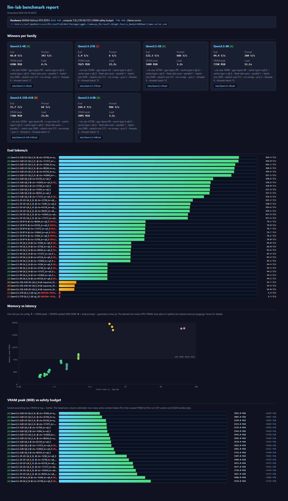

# llm-lab — measure, don't guess: benchmark llama.cpp on consumer GPUs

> A `--ctx-size 262144` flag silently caused Windows to page model weights to
> system RAM, dropping eval from 45 t/s to 10 t/s. No error, no warning.
> `llm-lab` automates the discovery of that cliff and the configuration that
> avoids it.

`llm-lab` is a benchmark crawler/tester for local GGUF models served by
[llama.cpp](https://github.com/ggml-org/llama.cpp) on NVIDIA CUDA. **It has no
opinions about which models you should have.** You decide what sits on disk;
it catalogs them, sweeps a planned set of configurations, runs each one,
detects silent WDDM paging on Windows, and emits an HTML dashboard plus
per-model optimized `.bat` launchers.



> **v1 is Windows-only.** Detection of silent VRAM-to-RAM paging relies on a
> Windows-specific perf counter (`\GPU Adapter Memory(*)\Shared Usage`).
> Linux/macOS PowerShell 7 support is on the roadmap; on Linux the silent
> failure mode this tool primarily targets simply doesn't exist (CUDA OOMs
> cleanly).

> **For an LLM (or contributor) reading this**: skim the **architecture
> docs** for the full picture before diving into the code.
> Start with [`architecture/README.md`](architecture/README.md) for the
> methodology and folder map, then
> [`architecture/domain.md`](architecture/domain.md) for the vocabulary,
> then the most recent file under [`memories/`](memories/) for a
> point-in-time state-of-the-project primer.

---

## Contents

- [Quickstart](#quickstart)
- [Why not just …?](#why-not-just-)
- [Want comparable numbers across machines?](#want-comparable-numbers-across-machines)
- [Requirements](#requirements)
- [Setup details](#setup-details)
- [Usage](#usage)
- [Reference dataset — `get-sample-models`](#reference-dataset--get-sample-models)
- [How it works](#how-it-works)
- [WDDM paging detection](#wddm-paging-detection)
- [Output layout](#output-layout)
- [Known limitations](#known-limitations)
- [Roadmap](#roadmap)
- [Contributing](#contributing)
- [License](#license)

---

## Quickstart

```powershell
git clone https://github.com/your-username/llm-lab.git    # replace with your fork
cd llm-lab
.\llm-lab.ps1 init      # detect HW + write config.json
.\llm-lab.ps1 all       # discover -> plan -> bench -> report
start data\report.html  # open the dashboard
```

You're done. The winning configurations are in `data/bats/{model}.bat` —
double-click one and you have llama-server running with the optimized flags.

If you don't have any `.gguf` files yet, or want to try every model from the
curated reference set, add `-DownloadSamples` to `all` and llm-lab will fetch
the models first, then run the full pipeline:

```powershell
.\llm-lab.ps1 all -DownloadSamples   # ~100 GB, full reference set (prompts to confirm)
```

Or you can just try out with one sample:

```powershell
.\llm-lab.ps1 all -DownloadSamples -SampleId qwen3.5-9b-q4km   # ~5 GB, one model
```

## Why not just …?

| You might be thinking | Why this exists anyway |
|-----------------------|------------------------|
| **`llama-bench`** | That's a single-config micro-benchmark. `llm-lab` is the harness around it: cataloging your models, planning a sweep, executing it, picking winners, generating launchers. |
| **LM Studio / Ollama** | Those are runtimes. They run a model; they don't measure across configurations to find your hardware's optimum. |
| **"I'll just try `-ngl 20` and `-ngl 24`"** | That's a guess. With `llm-lab` you measure all reasonable values, in batch, with WDDM-paging detection so the result you ship isn't the one quietly using system RAM. |
| **HuggingFace's leaderboards** | Those rank model *quality*. `llm-lab` ranks *configurations* on **your** GPU. |

## Want comparable numbers across machines?

Run `.\llm-lab.ps1 get-sample-models -DownloadAll` (~100 GB) to populate a
[curated reference set](#reference-dataset--get-sample-models) spanning 0.8B
dense up to 31B MoE. Anyone running the same set on different hardware
produces directly comparable `data/results/*.json` files — drop them into a
shared repo to crowdsource a "what runs well on what GPU" dataset.

## Requirements

- **Windows 10/11** with PowerShell 5.1+
- **NVIDIA GPU + recent driver** (tested on RTX 2070 8 GB, compute 7.5)
- `nvidia-smi` on PATH (bundled with the NVIDIA driver)
- A **llama.cpp CUDA build** — get a release from the
  [llama.cpp releases page](https://github.com/ggml-org/llama.cpp/releases)
  and unzip anywhere. (A Vulkan-only build also works on NVIDIA, but is
  ~10-15% slower; `bench` will print a yellow warning if it spots this
  mismatch. Older builds may also lack support for newer model architectures
  — `bench` detects "unknown model architecture" failures and skips the
  remaining tests of the affected model instead of running them all to fail.)

## Setup details

`init` is interactive (or pass `-NonInteractive`) and produces `config.json`
with absolute paths from your machine. It:
- queries `nvidia-smi` for `vram_total_mib`, `gpu_name`, compute capability
- queries WMI for `cpu_cores_physical` / `cpu_threads_logical`
- searches sibling folders for `llama-server.exe` and `.gguf` directories
- writes only the override fields; everything else inherits from `config.default.json`

`config.json` is in `.gitignore`, so personal paths stay off your fork.
Open [`config.default.json`](config.default.json) for the full schema with
inline comments.

You can edit `config.json` by hand, or use `config get/set/unset` from the
command line — see [Editing config from the CLI](#editing-config-from-the-cli)
below.

### Run `llm-lab` from anywhere

The repo ships with `llm-lab.cmd`, a thin wrapper around the PowerShell
script. Run `install` once to put this directory on your user PATH:

```powershell
.\llm-lab.ps1 install
```

That's it. Now from any directory, in either cmd.exe or PowerShell:

```powershell
llm-lab help
llm-lab status
llm-lab bench -Model Qwen3.5-9B
llm-lab config set hardware.vram_safety_budget_pct 0.92
```

`install` writes only the User-scope PATH (no admin rights), is
idempotent, and patches the current shell session so you don't have to
reopen the terminal. To revert, run `llm-lab uninstall`.

The wrapper sets `-ExecutionPolicy Bypass -NoProfile`, so it works on
locked-down machines and starts faster (no profile load). One caveat: if
you set `scan_paths` to a relative path like `"."`, that resolves to your
current working directory at invocation time — use absolute paths (e.g.
`config set scan_paths "D:\models"`) to make the global command
location-independent.

## Usage

After `llm-lab install` you can drop the `.\llm-lab.ps1` prefix; before
that, every command works the same way with the prefix from the project
directory.

```powershell
llm-lab init                # one-time setup -> config.json
llm-lab discover            # scan scan_paths[] for .gguf -> data/catalog.json
llm-lab plan                # generate test configs -> data/plan.json
llm-lab bench               # run pending configs -> data/results/*.json
llm-lab report              # HTML + .bat for winners -> data/report.html + data/bats/
llm-lab all                 # discover + plan + bench + report
llm-lab status              # state + config + global-install indicator
llm-lab config <list|get|set|unset>  [<key>] [<value>]   # inspect/edit config
llm-lab install / uninstall # add or remove this dir from user PATH
llm-lab help [<command>]    # general help, or detail for one command
llm-lab get-sample-models   # curated reference shelf (see below)
```

Run `.\llm-lab.ps1 help <command>` for the usage block + flags + examples of
any subcommand (e.g. `help bench`, `help config`).

### Filters

| Flag | Effect |
|------|--------|
| `-Model <regex>` | Only operate on models whose name matches |
| `-Tier {A,B,C}`   | Only operate on the selected tier |
| `-Id <pattern>`   | Only run configs whose test ID matches (wildcards ok) |
| `-DryRun`         | Print what would be done; don't run llama-server |
| `-Force`          | Re-run tests whose results already exist |

### CLI overrides (skip config.json editing)

| Flag | Used by | Effect |
|------|---------|--------|
| `-ScanPath <path[,path,...]>` | `discover`, `init`, `all` | Replaces `scan_paths` for this run |
| `-LlamaServer <path>`         | `bench`, `report`, `init`, `all` | Replaces `llama_server_exe` for this run |
| `-GroupBy {model,model+variant}` | `report`, `all` | How to group results when picking winners. Default `model`. With `model+variant` you get a separate winner (and `.bat`) per variant. |
| `-DownloadSamples`            | `all` | Run `get-sample-models` before the pipeline. Without a filter implies "download everything"; combine with `-SampleId` or `-Model` to narrow. |

```powershell
# Compare Q4 vs Q8 of the same model by giving them separate winners
.\llm-lab.ps1 all -GroupBy model+variant
# -> data/bats/Qwen3.5-9B_Q4_K_M.bat
# -> data/bats/Qwen3.5-9B_Q8_0.bat
```

### Common workflows

```powershell
# A. You already have .gguf files on disk
.\llm-lab.ps1 init      # one-time setup, writes config.json
.\llm-lab.ps1 all       # discover -> plan -> bench -> report

# B. Start fresh with the curated reference set (one shot, download + bench)
.\llm-lab.ps1 all -DownloadSamples                            # ~100 GB; prompts to confirm
.\llm-lab.ps1 all -DownloadSamples -SampleId qwen3.5-9b-q4km  # one model, ~5 GB
.\llm-lab.ps1 all -DownloadSamples -Model "Qwen3.5"           # one model

# C. Pure CLI, no config.json (CI / try-and-throw-away)
.\llm-lab.ps1 get-sample-models -SampleId qwen3.5-0.8b-q4xl -Destination .\models
.\llm-lab.ps1 all -ScanPath .\models -LlamaServer "C:\bin\llama-server.exe"
```

### Editing config from the CLI

You don't have to open `config.json` to tweak settings. Four sub-actions cover
the common workflow:

```powershell
.\llm-lab.ps1 config list                                         # all keys, type, [default] vs [local]
.\llm-lab.ps1 config get hardware.vram_total_mib                  # one value
.\llm-lab.ps1 config get hardware                                 # whole subtree
.\llm-lab.ps1 config set hardware.vram_safety_budget_pct 0.92     # write to local override
.\llm-lab.ps1 config set scan_paths "D:\models,E:\cache"          # CSV for arrays
.\llm-lab.ps1 config set bench.warmup false                       # bools: true/false/1/0/yes/no
.\llm-lab.ps1 config unset hardware.vram_safety_budget_pct        # remove override, default applies
```

- Types are inferred from `config.default.json` (so `... vram_total_mib 8192`
  becomes int, not string). Keys with `null` defaults auto-detect from the
  value shape (digits → int, decimal → float, true/false → bool).
- `config set` writes only the leaf you specified into `config.json`;
  everything else continues to inherit from `config.default.json`. This
  matches the override-only philosophy — your fork stays clean.
- Trying to `set` a key that doesn't exist in the schema is rejected (so a
  typo doesn't silently bury a flag). Add new keys by editing
  `config.default.json` directly.

When `-DownloadSamples` runs without a configured scan path (no `config.json`,
no `-ScanPath`), llm-lab puts the files in `./downloaded-models/` under the
project root and points `discover` there automatically.

## Reference dataset — `get-sample-models`

To make benchmark numbers **comparable across machines**, the repo ships a
curated list of reference GGUF models in [`samples.json`](samples.json)
spanning 0.8B up to 31B, dense and MoE. Anyone running `get-sample-models`
gets the same dataset, so reported tokens/s on different hardware can be
compared directly.

```powershell
.\llm-lab.ps1 get-sample-models                                    # list (OK = on disk)
.\llm-lab.ps1 get-sample-models -SampleId qwen3.5-9b-q4km          # download one
.\llm-lab.ps1 get-sample-models -Model "Gemma-4"                   # by model
.\llm-lab.ps1 get-sample-models -DownloadAll                       # all (~100 GB, prompts to confirm)
.\llm-lab.ps1 get-sample-models -DownloadAll -DryRun               # preview
.\llm-lab.ps1 get-sample-models -SampleId qwen3.5-9b-q4km -Destination "D:\models"
```

Files land at `{scan_paths[0]}/{target_dir}/{hf_file}` so a subsequent
`discover` picks them up automatically.

| Tier hint | Model | Approx size | Why it's in the reference set |
|-----------|--------|-------------|-------------------------------|
| A | Qwen3.5 0.8B Q8_0 + Q4_K_XL    | 0.5 - 0.8 GB | Bandwidth/sanity baseline |
| A | Qwen3.5 2B UD-Q4_K_XL + BF16   | 1.3 - 3.5 GB | Multimodal small + quality reference |
| A | Qwen3.5 4B Q4_K_M              | 2.6 GB       | Mid-size dense |
| A | Qwen3.5 9B Q4_K_M              | 5.2 GB       | 8-GB-VRAM sweet spot |
| C | Qwen3.5 27B Q4_K_S             | 15 GB        | Partial-offload case |
| B | Qwen3.6 35B-A3B UD-Q4_K_M      | 20 GB        | MoE routing (3B active) |
| A | Gemma-4 E2B / E4B Q4_K_M       | 2.3 / 4.6 GB | Multimodal (vision + audio) |
| B | Gemma-4 26B-A4B UD-Q4_K_M      | 15 GB        | MoE counterpart to Qwen3.6 |
| C | Gemma-4 31B Q4_K_M             | 18 GB        | Large dense, partial offload |

When a download fails: 401 = accept license on HuggingFace; 404 = open a PR
fixing `samples.json`; flaky network = fall back to `huggingface-cli download`.

## How it works

`llm-lab`'s pipeline is five sequential stages, each writing to a file the
next one reads:

```
       you (or get-sample-models)
                │
                ▼
       ┌──────────────────┐
       │  .gguf files on  │ ◄── config.json (scan_paths, llama_server_exe, hardware)
       │  scan_paths[...] │
       └────────┬─────────┘
                │
                ▼
       ┌──────────────────┐
   1.  │     discover     │ ──► data/catalog.json   (N models, metadata)
       └────────┬─────────┘
                │
                ▼
       ┌──────────────────┐
   2.  │       plan       │ ──► data/plan.json      (K configs, K >> N)
       └────────┬─────────┘
                │
                ▼
       ┌──────────────────┐
   3.  │      bench       │ ──► data/results/*.json (one JSON per config)
       └────────┬─────────┘
                │
                ▼
       ┌──────────────────┐
   4.  │      report      │ ──► data/report.html   + data/bats/{group_key}.bat
       └──────────────────┘
```

### Stage 1 — `discover` builds the catalog

Recursive glob of `scan_paths`, filtered by `exclude_patterns` (defaults skip
`mmproj-*.gguf`, `ggml-vocab-*.gguf`, `*draft*.gguf`). For each surviving file:

- **Model** is the filename stem stripped of the variant suffix, e.g.
  `Qwen3.5-9B-Q4_K_M.gguf` → model `Qwen3.5-9B`, variant `Q4_K_M`.
- **Series** is parsed from the model (e.g. `Qwen3.5-9B` → series `Qwen3.5`).
- **MoE detection** is regex on the model: matches `A\d+B` (e.g. `Qwen3.6-35B-A3B`)
  or contains `MoE` / `Mixtral`. *(See [Known limitations](#known-limitations) for false-positive risk.)*
- **mmproj pairing**: a sibling `mmproj-*.gguf` in the same directory is
  auto-paired by precision preference (F16 → BF16 → F32). Concrete example:
  if the folder contains
  ```
  Qwen3.5-2B-UD-Q4_K_XL.gguf
  mmproj-F16.gguf
  ```
  the catalog entry for `Qwen3.5-2B-UD-Q4_K_XL.gguf` records
  `mmproj = ".../mmproj-F16.gguf"`, and every benchmark for that model gets
  `--mmproj "..."` injected automatically.

### Stage 2 — `plan` expands each model into a config sweep

Each cataloged model produces N test configurations based on its tier:

| Tier | Entry rule | Sweep dimension | Default values | # configs |
|------|-----------|-----------------|----------------|----------:|
| **A** | `model_size + mmproj_size + overhead < vram_safety_budget` | (ctx, KV quant) pairs from `tier_a_candidates` | 16K/32K/64K/96K @ q8_0; 128K/160K @ q4_0 | 6 |
| **B** | model is MoE | `--n-cpu-moe` from `moe_ncpumoe_sweep` | `[28, 30, 32, 34, 36]` | 5 |
| **C** | `model_size + overhead >= vram_safety_budget` and not MoE | `--gpu-layers` from `c_ngl_sweep` | `[20, 24, 28, 32, 36]` | 5 |

Two quants of the same model both get expanded — if you have
`Qwen3.5-0.8B-Q8_0.gguf` and `Qwen3.5-0.8B-UD-Q4_K_XL.gguf`, plan generates
12 configs (6 Tier A candidates × 2 variants). Both compete in the same model
pool when `report` picks winners.

#### `vram_safety_budget` defined explicitly

```
vram_safety_budget_mib = vram_total_mib × vram_safety_budget_pct
```

Default `vram_safety_budget_pct = 0.95`. On an RTX 2070 (8192 MiB) that's
`7782 MiB`. The 0.95 came from empirical observation on Windows 11: above
~95% VRAM use, the WDDM driver starts paging to system RAM (Shared GPU
Memory), and inference throughput collapses 2-4× without any error message.
Keeping the safety budget below this cliff avoids the issue.

If you have a 24-GB card and want to push closer to the limit, raise the pct
to 0.97 or 0.98 in `config.json`. If you keep heavy GPU compositors open
(many Chrome tabs, video calls), lower it to 0.90.

#### `overhead` defined explicitly

The `overhead_mib` budget (default `1200`, in `tier_classification.overhead_mib`)
covers everything that lives in VRAM **besides the model weights**:

| Component | Typical size |
|-----------|--------------|
| Compute buffers (one-shot tensors per forward pass) | 400 - 600 MiB |
| Recurrent / SSM state (for hybrid models like Qwen3.5) | 50 - 200 MiB |
| Graph / scheduler metadata | ~100 MiB |
| Driver headroom (avoids hitting the WDDM cliff during transients) | ~300 MiB |

Tune `overhead_mib` if your bench runs are repeatedly OOM-ing or, conversely,
leaving large VRAM unused.

The Tier A entry rule effectively reads "*the weights plus their mmproj plus
fixed overhead must fit in the safety budget*", and is used as a pre-flight
check so a 27 GB Q8 model isn't even considered for full-GPU configs.

### Stage 3 — `bench` runs each config

For every config:

1. Kill any leftover `llama-server.exe`. Snapshot baseline VRAM and Shared GPU memory.
2. Spawn `llama-server` with the config's flags + `base_args` from config + thread flags from `hardware.cpu_*`.
3. Wait up to `bench.wait_sec_ready` for `/v1/models` to respond 200.
4. **Warmup** — one identical-prompt completion with `cache_prompt=true`, `n_predict=8`. This compiles CUDA graphs for the actual batch sizes. **Without this the first prompt reports ~10× slower `prompt_tps`**, which would silently pollute every comparison.
5. **Bench** — the real `/completion` call, `cache_prompt=false`, `n_predict` from config. Pull `prompt_per_second` and `predicted_per_second` from the server's own timings.
6. Kill the process; parse stderr for `CUDA0 model buffer size`, `CUDA0 KV buffer size`, `CUDA_Host compute buffer size`, `offloaded N/M layers`, etc.
7. Compute WDDM flags (saturation %, shared-memory delta).
8. Cache to `data/results/{TestID}.json`. Subsequent runs skip configs whose JSON already exists, unless you pass `-Force`. **A long bench run is safely interruptible** — kill it any time and re-run; only missing tests re-execute.

### Stage 4 — `report` picks winners and emits artifacts

Results are grouped by `-GroupBy` (default `model`):

```text
for each result where ok == true:
    safe = (shared_peak_mib <= 0)         # no WDDM paging delta
    winner[group_key] = this result if:
      - no current winner for this group, OR
      - this is safe and current is not (safety upgrade), OR
      - both equally safe/unsafe AND this has higher eval_tps
```

Safety preference is intentional: a 30 t/s safe config is more useful than a
50 t/s config that's one Chrome tab away from collapsing.

Output:
- `data/report.html` — sortable tables, per-model winner cards, charts, WDDM
  watchlist (configs where `shared_peak_mib > shared_delta_confirm_mib` or
  `vram_saturation > 0.92`).
- `data/bats/{group_key}.bat` — one launcher per group with the winning
  cmdline, annotated header reporting the measured numbers.

## WDDM paging detection

On Windows, when VRAM is saturated the NVIDIA driver **does not raise OOM** —
it pages to "Shared GPU memory" (a slice of system RAM mapped via PCIe). The
model continues to run, but each token incurs PCIe round-trips, collapsing
eval throughput by 2-4×. Two heuristics are recorded in every result:

1. **`shared_peak_mib`** — peak of `Get-Counter "\GPU Adapter Memory(*)\Shared Usage"` *minus* the baseline measured before launching `llama-server`. Subtracting the baseline is essential — Chrome and Discord on a desktop can hold hundreds of MiB of shared GPU memory at all times. Treating absolute shared usage as paging would false-flag every run.
2. **`wddm_vram_saturation`** — `vram_peak_mib / vram_total_mib`. Above
   `wddm_detection.vram_saturation_threshold` (default 0.92) the run is
   marked as suspicious even if shared delta was zero (paging may happen
   between the polling samples).

A result is "**confirmed paging**" when the shared delta exceeds
`wddm_detection.shared_delta_confirm_mib` (default 500 MiB). Smaller deltas
are treated as background drift.

## Output layout

```
llm-lab/
├── config.default.json      # committed, no personal paths
├── config.json              # gitignored, written by `init`
├── llm-lab.ps1              # the tool
├── samples.json             # committed, the reference shelf
├── report.template.html     # committed, HTML skeleton with %%placeholders%%
├── README.md
├── LICENSE
├── .gitignore
├── docs/
│   └── screenshot.png       # the dashboard image embedded above
└── data/                    # gitignored, all runtime artifacts
    ├── catalog.json         # discovered models
    ├── plan.json            # planned test configs
    ├── results/             # one JSON per test
    ├── logs/                # llama-server stderr per test
    ├── bats/                # winner launchers
    └── report.html          # the dashboard
```

## Known limitations

- **Single run per config (N=1).** Each config is benchmarked once. Empirical
  variance on a quiet RTX 2070 desktop: about **±5 % on `eval_tps`** and
  **±10 % on `prompt_tps`**. That's enough resolution to spot a 4× speedup
  but not a 5 % regression. If you need stable numbers, the cleanest patch is
  a loop in `Invoke-OneBench` taking the median of 3 runs (the rest of the
  pipeline is unchanged). PRs welcome.
- **MoE detection is a regex on the filename.** `model =~ /A\d+B/` correctly
  matches `Qwen3.6-35B-A3B` and `Mixtral-8x7B`-style names but **a model
  innocently named `something-A100B-special.gguf` would be false-flagged as
  MoE** and routed to a `--n-cpu-moe` sweep that won't apply to it. If this
  bites you, add the model to a manual `dense_overrides` list in
  `config.json` (not yet implemented; PR welcome) or rename the file.
- **Single GPU only.** No `--tensor-split` planning or per-device VRAM
  tracking. Multi-GPU users have to point `-LlamaServer` at a build that
  defaults to the right device.
- **Windows-only WDDM detection.** On Linux, `shared_peak_mib` is always `-1`
  because the perf counter is Windows-specific. The other heuristic
  (saturation %) still works as a sanity check, and Linux drivers raise OOM
  cleanly so the silent-failure mode this tool primarily targets simply
  doesn't exist there.
- **Winner picker doesn't model quality.** Q4 is preferred over BF16 if it
  generates faster, even though BF16 has higher fidelity. If you care about
  the tradeoff, look at the report's per-model table and pick by hand —
  every number is preserved.
- **No HuggingFace authentication for `get-sample-models`.** Models that
  require accepting a license (notably some Gemma variants) will return 401.
  Accept the license once on the website, or download those particular files
  with `huggingface-cli` separately.

## Roadmap

Things explicitly out of scope for v1 but reasonable next steps:

- `-PreferSpeed` flag to disable the WDDM-safety preference in the winner
  picker (so a paging-but-faster config can win when you accept the risk).
- Per-config N-run support with median + MAD for variance reduction.
- `dense_overrides` list to bypass MoE filename regex false positives.
- Speculative decoding planning: pair a small model in the same series
  (e.g. Qwen3.5-0.8B as draft for Qwen3.5-9B) and benchmark the
  `--draft-max` configurations.
- Quality scoring: optionally run a small task suite (truthful-qa subset,
  HumanEval-mini) per config so the winner picker can balance speed vs
  quality.
- Linux/macOS port: a `nvml`-based equivalent of the WDDM shared-memory
  delta heuristic.
- Multi-GPU planning with `--tensor-split`.

## Contributing

Each of these is a 1-day PR:

- A new entry in `samples.json` for a model not yet covered (please verify
  the HuggingFace URL is live).
- A `dense_overrides` list to fix MoE false positives.
- Linux port for WDDM detection: parse `nvml` over time and compare against
  the GPU's actual pinned memory.
- A median-of-N runner for variance reduction.

The script is one file (~990 lines of PowerShell). The HTML template is
self-contained (vanilla CSS + ~80 lines of inline JS, no build step).

## License

[MIT](LICENSE).
